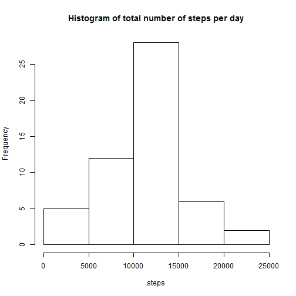
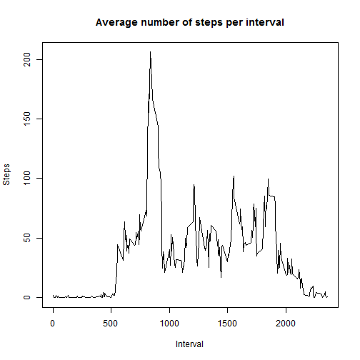
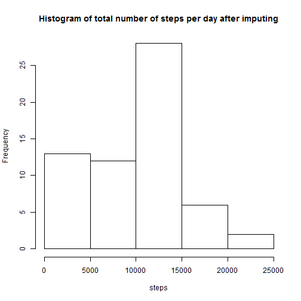
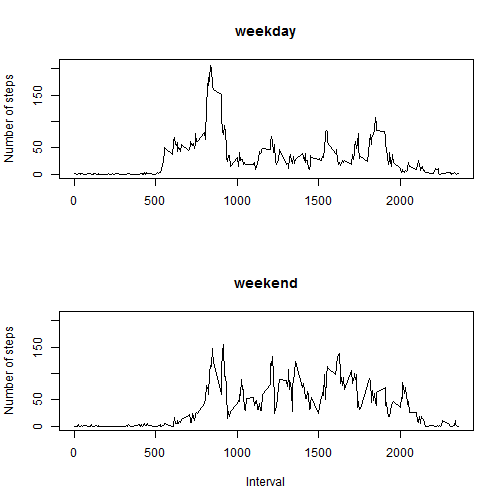

# Reproducible Research: Peer Assessment 1

## Loading and preprocessing the data

```r
setwd("C:/Users/miguel.picallo.cruz/Documents/personal/coursera/JH data science/reproducible research")
data = read.csv("./data/activity.csv")
data$date = as.Date(data$date)
```


## What is mean total number of steps taken per day?

```r
sumday = tapply(data$steps, data$date, function(x) {
    if (sum(is.na(x)) == length(x)) {
        return(NA)
    } else {
        sum(x, na.rm = T)
    }
})
hist(sumday, main = "Histogram of total number of steps per day", xlab = "steps")
```

 

```r
print(paste0("mean: ", mean(sumday, na.rm = T)))
```

```
## [1] "mean: 10766.1886792453"
```

```r
print(paste0("median: ", median(sumday, na.rm = T)))
```

```
## [1] "median: 10765"
```


## What is the average daily activity pattern?

```r
suminterval = tapply(data$steps, data$interval, function(x) {
    if (sum(is.na(x)) == length(x)) {
        return(NA)
    } else {
        sum(x, na.rm = T)/(length(x) - sum(is.na(x)))
    }
})
plot(as.numeric(names(suminterval)), suminterval, type = "l", main = "Average number of steps per interval", 
    xlab = "Interval", ylab = "Steps")
```

 

```r
indmax = which.max(suminterval)
print(paste0("interval with maximum number of steps: ", names(indmax)))
```

```
## [1] "interval with maximum number of steps: 835"
```


## Imputing missing values

```r
print(paste0("total number of NAs: ", sum(is.na(data$steps))))
```

```
## [1] "total number of NAs: 2304"
```

```r
medianinterval = tapply(data$steps, data$interval, function(x) {
    median(x, na.rm = T)
})

# impute using the median for each interval
datanew = data
for (i in 1:nrow(data)) {
    if (is.na(datanew$steps[i])) {
        datanew$steps[i] = medianinterval[which(as.numeric(names(medianinterval)) == 
            datanew$interval[i])]
    }
}

sumdaynew = tapply(datanew$steps, datanew$date, function(x) {
    if (sum(is.na(x)) == length(x)) {
        return(NA)
    } else {
        sum(x, na.rm = T)
    }
})
hist(sumdaynew, main = "Histogram of total number of steps per day after imputing", 
    xlab = "steps")
```

 

```r
print(paste0("mean: ", mean(sumdaynew, na.rm = T)))
```

```
## [1] "mean: 9503.86885245902"
```

```r
print(paste0("median: ", median(sumdaynew, na.rm = T)))
```

```
## [1] "median: 10395"
```


### Conclusions:
Mean and median seem to be difference, since the NA values were not taken into account before, but now they have some imputed value.

## Are there differences in activity patterns between weekdays and weekends?

```r
Sys.setlocale("LC_TIME", "English")
```

```
## [1] "English_United States.1252"
```

```r
datanew$day = "weekday"
for (i in 1:nrow(datanew)) {
    if (weekdays(datanew$date[i]) %in% c("Saturday", "Sunday")) {
        datanew$day[i] = "weekend"
    }
}
datanew$day = as.factor(datanew$day)

par(mfrow = c(2, 1))
sumintervalwd = tapply(datanew$steps[which(datanew$day == "weekday")], datanew$interval[which(datanew$day == 
    "weekday")], function(x) {
    if (sum(is.na(x)) == length(x)) {
        return(NA)
    } else {
        sum(x, na.rm = T)/(length(x) - sum(is.na(x)))
    }
})
plot(as.numeric(names(suminterval)), sumintervalwd, type = "l", xlab = "", main = "weekday", 
    ylab = "Number of steps", ylim = c(0, 210))

sumintervalwe = tapply(datanew$steps[which(datanew$day == "weekend")], datanew$interval[which(datanew$day == 
    "weekend")], function(x) {
    if (sum(is.na(x)) == length(x)) {
        return(NA)
    } else {
        sum(x, na.rm = T)/(length(x) - sum(is.na(x)))
    }
})
plot(as.numeric(names(suminterval)), sumintervalwe, type = "l", main = "weekend", 
    ylab = "Number of steps", xlab = "Interval", ylim = c(0, 210))
```

 


### Conclusions:
There seem to be some differences in the means for each case. During the weekend the activity seems to be higher during the whole day (leaving night aside), than during the weekdays. During the weekdays there seems to be a peak corresponding to waking time, and then it lowers during working hours. Both are almost equal to zero during night hours, representing no activity during sleeping.
